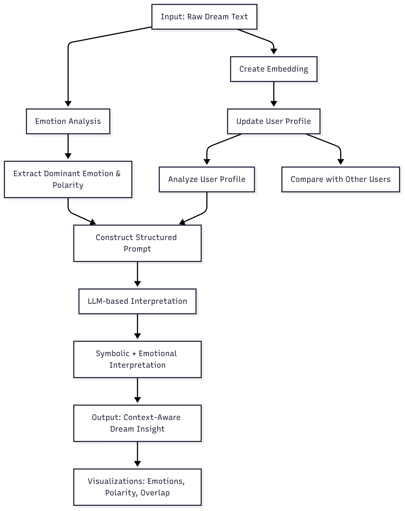

# 🌙 DreamProfiler: Personalized AI-Powered Dream Interpretation

DreamProfiler is an intelligent, memory-based AI system that interprets dreams through a **personalized** and **emotionally grounded** lens. Unlike generic LLMs, it learns from each user’s dream history to provide **context-aware, psychologically meaningful** insights.

---

## 📌 Overview

### 🔍 What DreamProfiler Does:
- 🔬 Detects and explains **dominant emotions** and their intensities  
- 🧠 Identifies and remembers **recurring symbols and metaphors**  
- 📈 Tracks **emotional arcs** and **dream evolution** over time  
- 📘 Outputs structured and psychologically sound interpretations  

### 🧠 What Makes It Different:
- 🪞 Builds **user-specific dream profiles**
- 💾 Works **offline** with **local transformer models**
- 📊 Focuses on **emotion entropy** and **symbolic consistency**, not generic NLP metrics

---

## 💻 Setup & Installation

### ✅ Install Required Libraries
```bash
pip install transformers sentence-transformers matplotlib seaborn scikit-learn pandas
```

### 📁 Dataset Format
CSV with the following columns:
```
dream_id, user_id, dream_text
```

You can start with the included **`dream_dataset.csv`** containing 10,000 sample dreams.

Later, expand with more detailed and structured dream entries from sources like [DreamBank](http://www.dreambank.net/) for advanced analysis.

### ⚙️ Device Requirements
- ⚡ **GPU Recommended** (especially for transformer-based analysis)
- 🆓 **No GPU? Run on Google Colab:**
  1. Open `DreamProfiler.ipynb`
  2. Navigate to `Runtime > Change runtime type`
  3. Select **GPU** (T4 is automatically selected on free tier)

---

## 📊 Why Not Traditional NLP Metrics?

Dream interpretation is **subjective**, abstract, and emotion-driven. Therefore:

| ❌ Not Used | ✅ Instead |
|------------|-----------|
| BLEU, ROUGE, F1 | Emotion Entropy |
| Classification Accuracy | Psychological Continuity |
| Generic Sentiment Labels | User-specific Emotional Arcs |

---

## 🔢 Emotion Entropy: The Key Metric

Emotion Entropy = how **focused** or **scattered** the detected emotional landscape is.

| Interpretation Type | Entropy Score | Meaning |
|---------------------|---------------|---------|
| 🎯 Low Entropy      | 1.041         | Emotionally precise |
| 🎲 High Entropy     | 1.734         | Emotionally ambiguous |

👉 **Lower is better** — DreamProfiler shows consistently **lower entropy** than baseline models like DreamNet.

---

## 📊 Comparative Evaluation

| Metric                      | DreamProfiler ✅ | DreamNet ❌ | Winner        |
|-----------------------------|------------------|-------------|---------------|
| Emotion focus (entropy)     | 1.041 (lower)     | 1.734       | ✅ DreamProfiler |
| Dominant emotion alignment  | Yes               | Weak        | ✅ DreamProfiler |
| Symbol breakdown            | Rich              | Vague       | ✅ DreamProfiler |
| Interpretation justification| Provided          | None        | ✅ DreamProfiler |
| Visualization Clarity       | Structured        | Flat        | ✅ DreamProfiler |

---

## 🔄 End-to-End Flow

Below is the complete interpretation pipeline used by DreamProfiler:



---

## 🚀 Future Enhancements

- 🔁 Feedback-driven interpretation refinement  
- 🌍 Integration of cultural symbolism + dream archetypes  
- 📊 Interactive dashboard for personal dream analysis  

---

## ✅ Getting Started

1. Prepare your dataset (`dream_dataset.csv` or your own)
2. Launch the notebook
3. Let DreamProfiler begin decoding your subconscious – dream by dream 🧘‍♂️🌌
